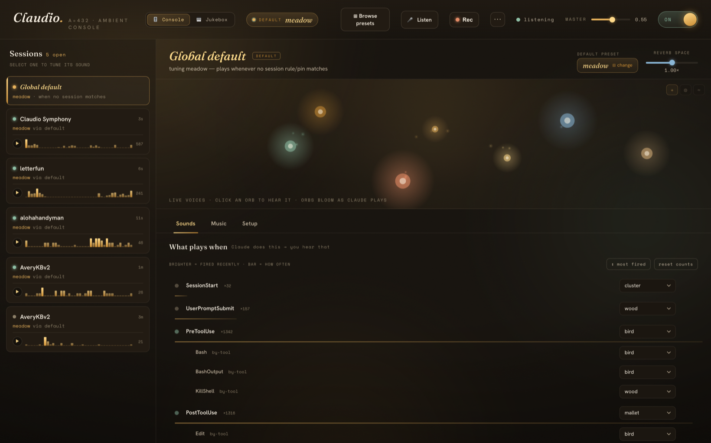

# Claudio Symphony 🎼

> **Hear your Claude Code sessions.** Every tool call, file edit, and finished thought becomes a soft, in-key sound — ambient music that moves with your AI pair-programmer.

```
                    ╭─────────────────────────────────────╮
                    │                                     │
                    │    every bash command, a low tone   │
                    │    every tool call is a soft pluck  │
                    │    every sub-agent finishing,       │
                    │    a tuned bell from across         │
                    │    the cathedral                    │
                    │                                     │
                    ╰─────────────────────────────────────╯
```

Claudio listens to Claude Code's hook events and turns them into generative, always-in-key ambient music. Twenty tool calls in three seconds become one soft blur of tones, not twenty separate dings — because that's the difference between music and Slack notifications.

It is **not** a notification system. It's a room your Claude session is happening inside. After about twenty minutes you stop hearing it as *music* and start hearing it as *the room* — and the room moves with your work.


> *The `claudio web` console: each voice is a glowing orb that lights up the instant Claude triggers it. Tune everything live; switch any of 36 presets with a click.*

---

## ✨ Why you'll love it

- 🎧 **It's calm, not noisy.** No beeps, no buzzes, no notification DNA. Soothing tones, soft mallets, distant bells — everything tuned to the same key (A = 432 Hz) so it never clashes, no matter how fast Claude is moving.
- 👂 **You can *hear* what your agent is doing.** A pluck for a tool call, a chime when a sub-agent returns, a slow bloom when a turn finishes. Without looking, you know whether Claude is grinding, waiting, or done.
- 🪟 **Hear every session at once.** Running Claude in five terminals? Give each project its own room. Now the chord of your whole workspace is audible — you can tell the quiet one finished and the busy one hit an error, eyes closed.
- 🎹 **36 presets, each a complete world.** Sunlit music box, lush cathedral, near-silent rainfall, plucked koto, vibraphone lounge, handbell carillon, Rhodes warmth… switch live, mid-session, with one command.
- 🖥️ **A genuinely beautiful web console.** A living constellation of your voices that blooms in real time as Claude plays them. Click an orb to audition; drag a slider to tune.
- 🎚️ **Tune everything, or nothing.** Sensible defaults out of the box — or open the TUI / web panel and shape every voice, reverb tail, and event mapping to taste.
- 🪶 **Featherweight & private.** ~1,500 lines of Python, one dependency (numpy), no daemon, no telemetry, no network. Hooks fire async with a 1-second timeout, so they *never* slow Claude down.

---

## 🎧 Listen first

Pick the room you want to work in. **`meadow` is the default** — bright, friendly, no drone. Switch any time, live, no restart:

```bash
claudio preset use cathedral
```

A few of the flagship rooms:

### 🌳  `meadow` — the happy one *(default)*
> *Wooden felt-mallets and kalimba in a sunlit room. A-major pentatonic — universal happy mode, no possible dissonance.*

Bright, satisfying, soft attacks. The "thock" of felt on wood for tool calls, kalimba tines for file edits, a small bird-chirp for shell commands, a 9-second major-triad bloom when Claude finishes. Like a music box in a sunny room.

### 🏛️  `cathedral` — the lush one
> *Modal drone bed with a full event palette. Eight voices. Always-on. The Eno / Budd / Frahm lane.*

A low drone never stops. Soft felt-piano notes resolve as tools complete; faint airy tones pass by during bash commands; a tuned bell rings when a sub-agent finishes. Nothing has a melody, nothing repeats — the room just moves with the work.

### 🌧️  `rainfall` — the quiet one
> *Sparse drops in a still room with rare long blooms. Silence is the canvas.*

Most of the time you hear nothing. PostToolUse plays a tiny 250 ms drop — a single bead of water on a still pond. Once a minute or two, a 25-second pad blooms in the distance and recedes. Late-night, deep-focus, almost-silent.

### 🎋  `koto` — the contemplative one
> *Plucked silk strings and a temple bowl in the A In-Sen scale. Spare, deliberate, like working through a tea ceremony.*

A different emotional space from the bright A-major family — minor-leaning, Japanese, unhurried. Koto for melody, bowl for sustains, mokugyo (wooden fish) for accents.

### 🌌  …and 32 more
Crystal glass bowls (`glassbright`), vibraphone (`lounge`), handbell carillon (`peal`), steel pan (`isleshine`), hammered dulcimer (`shimmerwire`), Rhodes EP (`tinewarm`), vocal-oo choir (`choirloft`), nylon guitar (`courtyard`), ocarina (`clayround`), santoor (`sunraga`), and many more — each a complete, render-tested room.

> **Hear them all in seconds:** `claudio audition` walks every preset on your speakers, or open the web panel and click ▶ on any card.

---

## 👂 Hear all your sessions at once

This is the part you didn't know you wanted. Claudio routes sound **per session**, with three lookup tiers (most specific wins):

1. **Session pin** — `claudio session pin <id> cathedral` → that one terminal, forever
2. **Directory rule** — `claudio rule add "/Users/me/quiet*" rainfall` → every session under that path
3. **Global default** — `claudio preset use meadow` → the catch-all

```bash
claudio sessions
#  #  sid       pin  preset      ago    src       cwd
#  1  33159931       meadow      0m     default   ~/Projects/shipping-app
#  2  ab12cd34  📌    rainfall    3m     pin       ~/Projects/quiet-stuff
```

Give your noisy refactor a different voice than your delicate prod fix, and the two coding sessions become *audibly* distinct. You stop alt-tabbing to check on them — you just *hear* which one needs you.

---

## 🖥️ The web control panel

```bash
claudio web      # opens a local, no-deps control panel in your browser
```

A "warm nocturne observatory" you'll actually want to leave open:

- 🌠 **A living constellation** — each voice is a glowing orb in a slow-drifting galaxy that **blooms in real time** the instant Claude triggers it. Watch your session play itself.
- 🎚️ **Tune anything live** — per-voice gain, reverb, echo; remap any event; switch presets; set per-session rules — all written to the same files the CLI and hooks read, so every change is instant.
- 🔭 **Browse 36 presets** in a searchable gallery, audition with one click.
- 🎵 **Music tab** — global scale override, quantize-to-tempo, and MIDI song mode.

Pure Python standard library on the backend (`127.0.0.1` only), Fraunces + Hanken + Space Mono on the front. No build step, no node_modules.

---

## 🎙️ Record & share your sounds

Found a preset + workflow that sounds *amazing*? Capture it and show it off.

```bash
claudio record           # record 30 seconds (the default)
claudio record 120       # record up to 5 minutes (300s max)
claudio record stop      # finish early and save right now
claudio record list      # see your saved clips
```

Here's the neat part: because Claudio already knows every sound it plays, recording **doesn't touch your mic or system audio** — it mixes the *exact* samples back into one clean track. Only Claudio, no room noise, no other apps, no virtual-audio-device setup. Clips land in `recordings/` as a `.wav` plus a small `.m4a` for easy sharing.

Prefer buttons? Hit **● Rec** in `claudio web` — pick a length, go work in your sessions, and grab the clip with a built-in player and download link.

> **Share it! 🎧** Post your clip with the preset name so others can hear how their sessions could sound. The more sounds people share, the richer Claudio gets — and if you tune a combination you love, [open a PR with the preset](#-make-your-own-preset) too.

---

## 📦 Install

```bash
git clone https://github.com/rmtbb/claudio-symphony.git
cd claudio-symphony
python3 install.py            # deps + render samples + write starter config
./bin/claudio install         # adds hooks to ~/.claude/settings.json
```

Open a new Claude Code session and listen. That's it.

**Requirements**
- 🍎 macOS (uses `afplay` — Linux/Windows support is one small patch in `event.py`; PRs welcome)
- 🐍 Python 3.9+ with **numpy**
- 💾 ~250 MB free for generated samples (one-time render, then static)

Tip: add `alias claudio='~/path/to/claudio-symphony/bin/claudio'` to your shell profile.

---

## 🎛️ Use it

```bash
claudio status                          # what's installed and active
claudio preset list                     # see all 36 presets
claudio preset use cathedral            # switch live (no Claude restart)
claudio off / claudio on                # silence everything / restore
claudio web                             # the browser control panel
claudio tune                            # interactive terminal tuner (TUI)
claudio audition                        # hear every preset, then pick one
claudio test                            # walk every voice in the active preset
claudio volume 0.4                      # master gain
claudio coffee                          # ☕ support the project (see below)
```

### `claudio tune` — the interactive tuner

```
─────────────── claudio tune ─────────────────────────────────
 preset: meadow   master: ▰▰▰▰▰▱▱▱▱▱ 0.55              ✓ saved
─ Voices — [gain]  press t for mioi ──────────────────────────
 ▶ mallet     gain ▰▰▰▰▰▱▱▱ 0.55  mioi ▰▰▱▱ 0.35s
   kalimba    gain ▰▰▰▰▰▱▱▱ 0.50  mioi ▰▰▱▱ 0.30s
   bloom      gain ▰▰▰▰▰▱▱▱ 0.55  mioi ▰▰▰▰ 10.00s
─ Events ─────────────────────────────────────────────────────
   PreToolUse              → wood
       · Bash              → bird
   PostToolUse             → mallet
       · Edit              → kalimba
       · on_failure        → chime
   Stop                    → bloom
─ TAB pane │ ↑↓ row │ ←→ value │ SPC play │ s save │ q ──────
```

Arrow keys move sliders, SPACE previews, `s` saves, `q` saves + quits. Changes are live — the next event picks them up without restarting Claude.

### Power-user CLI

```bash
claudio voice mallet gain 0.45            # per-voice gain in the active preset
claudio voice mallet mioi 0.5             # rate-limit (min seconds between hits)
claudio map PostToolUse:Edit pluck        # remap by tool
claudio map PostToolUse:on_failure -      # silence the failure variant
claudio scale use A_lydian                # global scale override
claudio song use mario                    # drive a voice from a MIDI melody
```

---

## 🎨 Make your own preset

Each preset is three things:

```
presets/<your-preset>/
├── preset.json    # voice configs + event → voice mapping
├── render.py      # generates the WAV samples
└── samples/       # output (gitignored — generated by render.py)
```

`render.py` imports the shared DSP helpers from the top-level `synth.py` (FFT-convolved reverb, ADSR envelopes, FFT lowpass, A = 432 frequency math) and writes WAVs into `samples/<voice>/`.

There's a full [composer's brief](docs/SONIC_FRAMEWORK.md) covering scale choices, palette design, and the anti-machine-gun strategies (per-voice MIOI, pressure accumulators, voice stealing, reverb-as-glue). **If you build a room you love, open a PR — we'd genuinely love to hear it.**

---

## ⚙️ How it actually works

```
Claude Code event
       │  hook fires (async, timeout 1s — never blocks the agent)
       ▼
event.py  (~50 ms total)
       │  ├─ reads the event JSON from stdin
       │  ├─ resolves the preset:  session pin → cwd rule → global default
       │  ├─ maps event → voice via preset.json
       │  ├─ rate-limits per voice (drops too-soon hits, banks "pressure"
       │  │   that bumps the next note's amplitude)
       │  ├─ picks a pitch melodically (Markov-weighted, stays in scale)
       │  └─ launches `afplay` detached
       ▼
   (your speakers)
```

`event.py` is stateless except for tiny per-voice timestamp files. `drone.py` is the only long-running process, and it auto-exits after 10 minutes of silence. No daemon to babysit, no port to conflict, no config server. ~1,500 lines of Python, one dependency.

---

## 🎼 The composer's notes

Three principles shaped every design choice:

1. **Inverse frequency → prominence.** Rare events get the foreground; common events whisper. The end-of-turn bloom feels loud because it happens once every few minutes; tool-starts get the softest, most disposable voice because they fire 5–30× a minute.
2. **No tempo, no melody, no notification DNA.** With nothing to predict and no memorable hook, the ear settles into landscape mode instead of flinch-mode. The instant something sounds like a notification, your nervous system flags every event as a possible interruption.
3. **The reverb tail is the glue.** A long tail on every voice means dense bursts smear into a wash rather than stack as discrete hits. The same patch handles the calm session and the chaotic one — the wash gets *thicker*, not *louder*.

Read [the full composer's brief](docs/SONIC_FRAMEWORK.md) — it's worth your time even if you never touch the code.

---

## 💛 Why I built this

I wanted my Claude Code sessions to make soothing, pleasant sounds — all in key, all cohesive — so that AI-assisted coding simply felt nicer to sit inside.

Then something happened while I was building it: I started to *rely* on it. I could suddenly hear what was happening across all of my active coding sessions — which one was busy, which had gone quiet, which just finished. What began as a small idea turned into something I genuinely can't use Claude Code without.

Slack pings condition you to flinch. A cathedral does not. A bell tuned to the room you're working in becomes a *fact about the room*, not an interruption. The hope is that the room starts to move with your work — and that you fall for it the way I did. 🌙

---

<a name="support"></a>

## ☕ Support — buy me a coffee

Claudio is free and MIT-licensed, built and maintained in my spare time. If it makes your sessions a little nicer, an on-chain tip means the world and keeps new presets coming. No platform, no cut, no signup — just send to whichever chain you already use:

| Chain | Address | Also accepts | Scan |
|---|---|---|---|
| **Bitcoin** (BTC) | `3Ht6H531DyWjgsxV289cWLYKJG8tVza2P5` | — |  |
| **Ethereum** (ETH) | `0xB239b34e42b4Bc571158e48a779099950C81C7d8` | USDC (ERC-20) · any EVM token |  |
| **Solana** (SOL) | `2PiDya4hpbpki7iUceyE1uYBDR3dQgW6uCN27JVJUHwS` | USDC (SPL) |  |
| **Dogecoin** (DOGE) | `D5HMGHjcRnvdcNY5LGAb1EcMpBm8FD8YHN` | — |  |

The Ethereum and Solana addresses receive their **native coin first** (ETH / SOL) and **also** take USDC on that chain — same address, no extra step. Send tokens only on the network listed above so they land somewhere I can reach them. You can also pull these up any time with `claudio coffee`, or via the **☕ Tip** button in `claudio web` (with QR + one-tap copy).

> **Verifying these addresses:** all four live in [`donate.json`](donate.json) as the single source of truth, and the app reads the same file. If an address here ever disagrees with `donate.json` or your wallet, treat it as a tampered diff and don't send. (These are public *receiving* addresses — never a private key.)

⭐ Can't tip? **Starring the repo and sharing it** helps just as much.

---

## 🙏 Credits

- The two design briefs in [`docs/`](docs/) — `SONIC_FRAMEWORK.md` and `TRIGGER_SURFACE.md` — were drafted as the spec for this project, and are worth reading on their own.
- DSP synthesis: pure numpy. Synthetic-IR FFT convolution for the reverb. No scipy, no external audio libraries.
- Inspired by Brian Eno (*Music for Airports*), Harold Budd (*The Pearl*), Stars of the Lid, Nils Frahm (*Felt*), William Basinski, Susumu Yokota.
- Tuning: A = 432 Hz throughout. Drone fundamentals are strictly just-intoned (3:2 root-to-fifth); upper voices are equal-tempered.

---

## 📄 License

MIT. Do whatever you want with it. If you build a preset you love, we'd love to see it. 💫

---

```
   tune the drone first
   get the reverb right
   add the pluck
   everything else is decoration on those three foundations
```
